## 2023年6月14日记

1.pycharm配置github，参照csdn中的教程，如果push时出现报错信息如下


则使用csdn教程修改git端口号

2.在该工程中安装python包，打开conda的命令行

激活该项目 `conda activate studyDeeplearningProject`

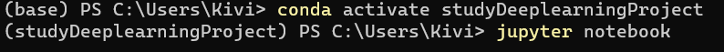

在该项目下使用`pip install +包名`安装相应的包


## 2023年6月15日记

1.可以不需要单独启动conda的命令行去启动jupyter，可以直接在pycharm中使用jupyter

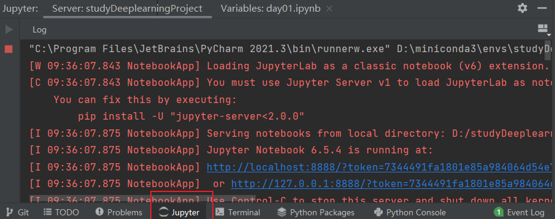

## 2023年6月16日记

1.分子布局和分母布局，回看不懂的话可看B站收藏的分子布局和分母布局的视频

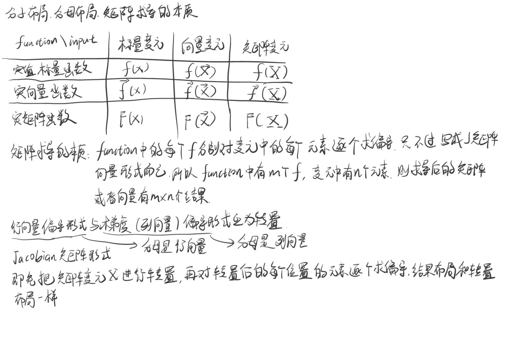

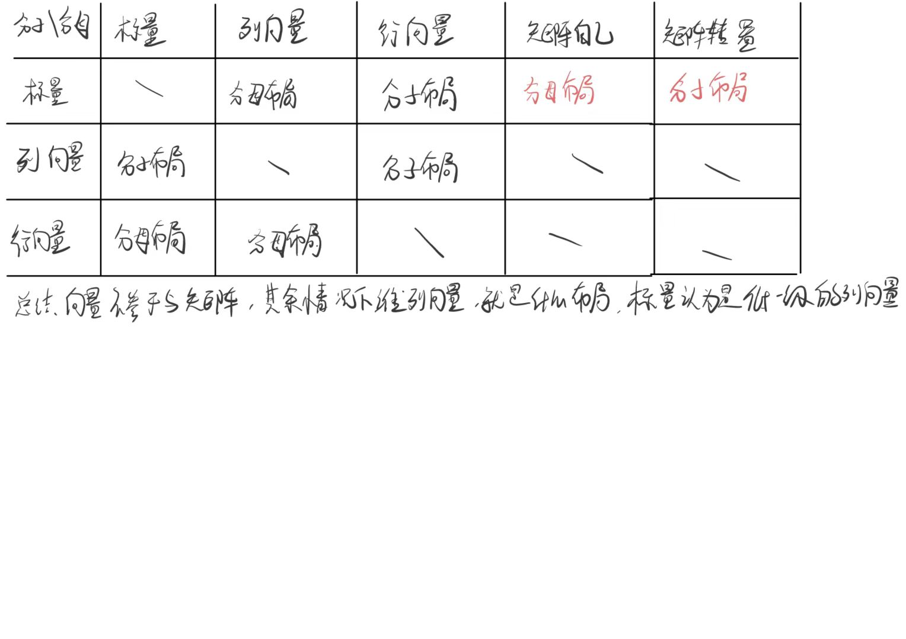

## 2023年6月17日记

1.[08 线性回归 + 基础优化算法](https://www.bilibili.com/video/BV1PX4y1g7KC?spm_id_from=333.1245.0.0)手写笔记

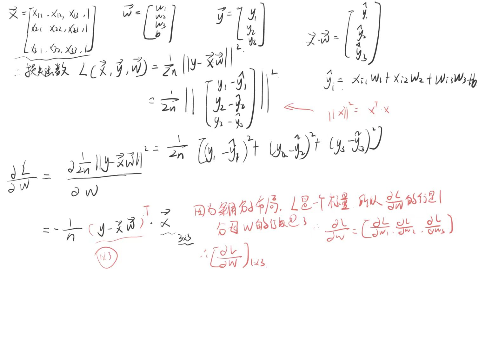

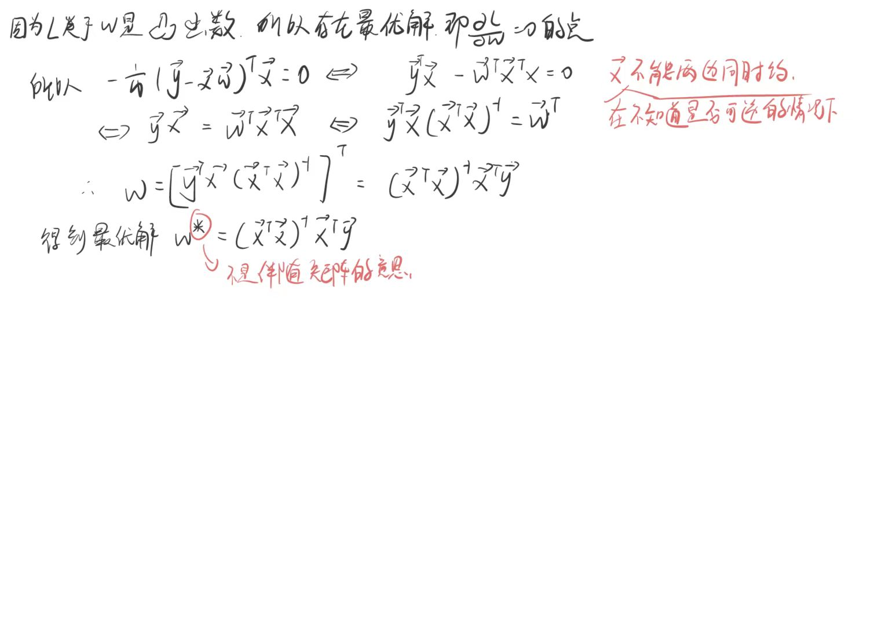

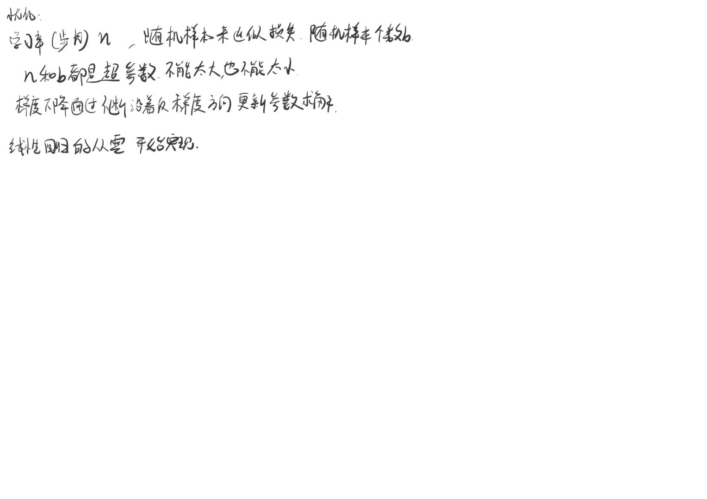

2.项目中无法安装d2l

参考csdn教程：[解决无法安装d2l](https://blog.csdn.net/sriting/article/details/129600084?ops_request_misc=%257B%2522request%255Fid%2522%253A%2522168697137016800226566225%2522%252C%2522scm%2522%253A%252220140713.130102334.pc%255Fall.%2522%257D&request_id=168697137016800226566225&biz_id=0&utm_medium=distribute.pc_search_result.none-task-blog-2~all~first_rank_ecpm_v1~rank_v31_ecpm-4-129600084-null-null.142^v88^koosearch_v1,239^v2^insert_chatgpt&utm_term=ERROR%3A%20Failed%20building%20wheel%20for%20pandas%20Failed%20to%20build%20pandas%20ERROR%3A%20Could%20not%20build%20wheels%20for%20pandas%2C%20which%20is%20required%20to%20install%20pyproject.toml-based%20projects&spm=1018.2226.3001.4187)

3.报错`ModuleNotFoundError: No module named 'torchvision'`，表示没有安装这个包，在命令行中安装即可

4.yield函数：指一个有yield语法的函数。

yield与return的不同：执行完一句yield语句后，会跳出函数，并返回yield生的值，并在此处设置一个断点。函数会在下次再调用该涵数时直接从上次断点处接下去执行。可以使用for语法接收yield函数生成的数据。

[yield语法详解]([(76条消息) python中yield的用法详解——最简单，最清晰的解释_python yield_冯爽朗的博客-CSDN博客](https://blog.csdn.net/mieleizhi0522/article/details/82142856?ops_request_misc=%7B%22request%5Fid%22%3A%22168699956216800211544533%22%2C%22scm%22%3A%2220140713.130102334.pc%5Fall.%22%7D&request_id=168699956216800211544533&biz_id=0&utm_medium=distribute.pc_search_result.none-task-blog-2~all~first_rank_ecpm_v1~rank_v31_ecpm-2-82142856-null-null.142^v88^koosearch_v1,239^v2^insert_chatgpt&utm_term=python中的yield和for&spm=1018.2226.3001.4187))

## 2023年6月18日记

1.《softmax回归》笔记

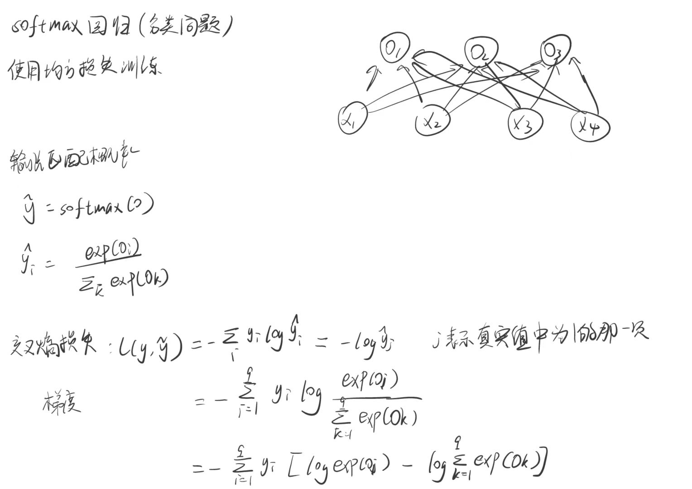

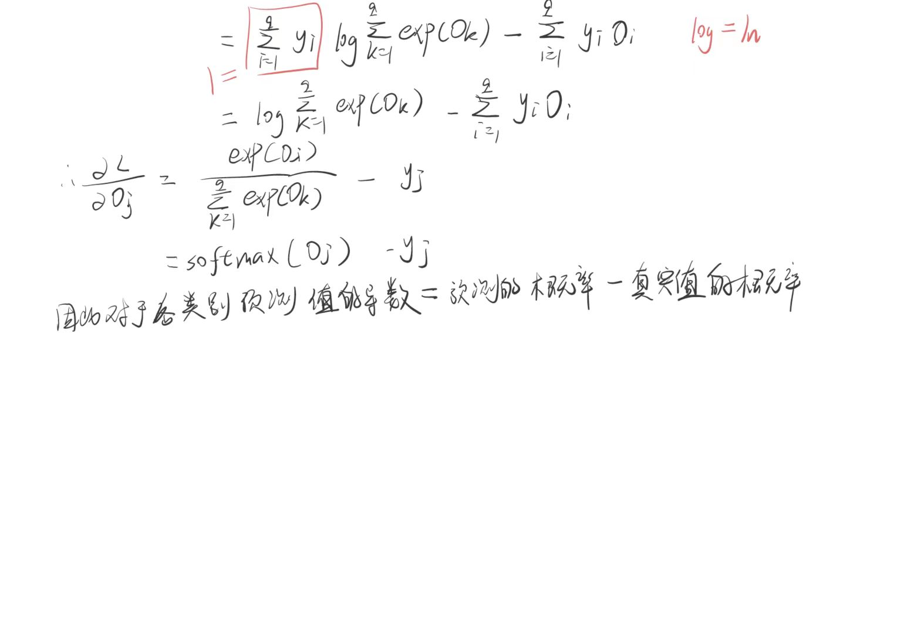

## 2023年6月19日记

1.transform

Python中的`transform`库指的是`torchvision.transforms`，它是PyTorch的官方图像处理库。`torchvision.transforms`提供了一组图像操作（transforms）的函数，可以方便地对图像进行变换、增强等操作，例如：

- 裁剪图像
- 缩放图像
- 翻转、旋转图像
- 将图像转换为张量
- 随机裁剪、翻转、缩放等图像增强操作

这些变换/操作可以被组合成一个`Compose`变换，以实现复杂的数据增强策略。同时，`torchvision.transforms`库还提供了一些针对特定任务的图像预处理，例如`Normalize`，它可以将输入图像像素值归一化到均值为0，标准差为1的分布中，从而提高模型的训练效果。

总之，`torchvision.transforms`库提供了一系列灵活的函数和变换操作，可以帮助开发者快速地对图像数据进行处理和增强，从而提高深度学习模型的性能。

## 2023年6月20日记

1.运行时报错：

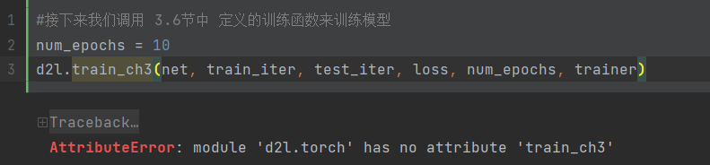

原因：python版本和torch版本不对

更改：更新python版本：在conda命令行中更换到对应环境下然后输入`conda install python==3.9`(换pyhon版本不推荐，因为还有其他错误)


然后更新torch和d2l版本

```
pip install torch==1.12.0
pip install torchvision==0.13.0
pip install d2l==0.17.6
```

安装过程中出现如下错误是因为开了vpn，将梯子挂掉就行

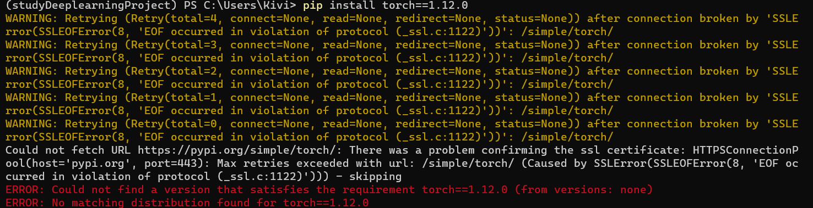

2.卸载环境，重装环境

参照B站教程：[Python深度学习：安装Anaconda与PyTorch库（GPU版本）_哔哩哔哩_bilibili](https://www.bilibili.com/video/BV1cD4y1H7Tk/?spm_id_from=333.337.search-card.all.click&vd_source=c59feb47a212ec5cb8076f498bab7429)

3.安装包速度很慢时：使用以下安装命令

```text
pip install 包名==版本号 -i http://pypi.douban.com/simple --trusted-host pypi.douban.com
```

4.成功换了环境和各种库的版本：和教材一样的版本

***<u>但是安装了torchGPU版本的没办法使用，不清楚原因</u>***

## 2023年6月21日记

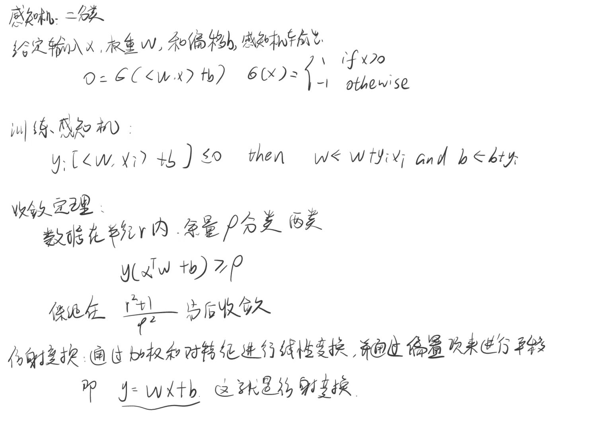

## 2023年6月23日记

1.手写笔记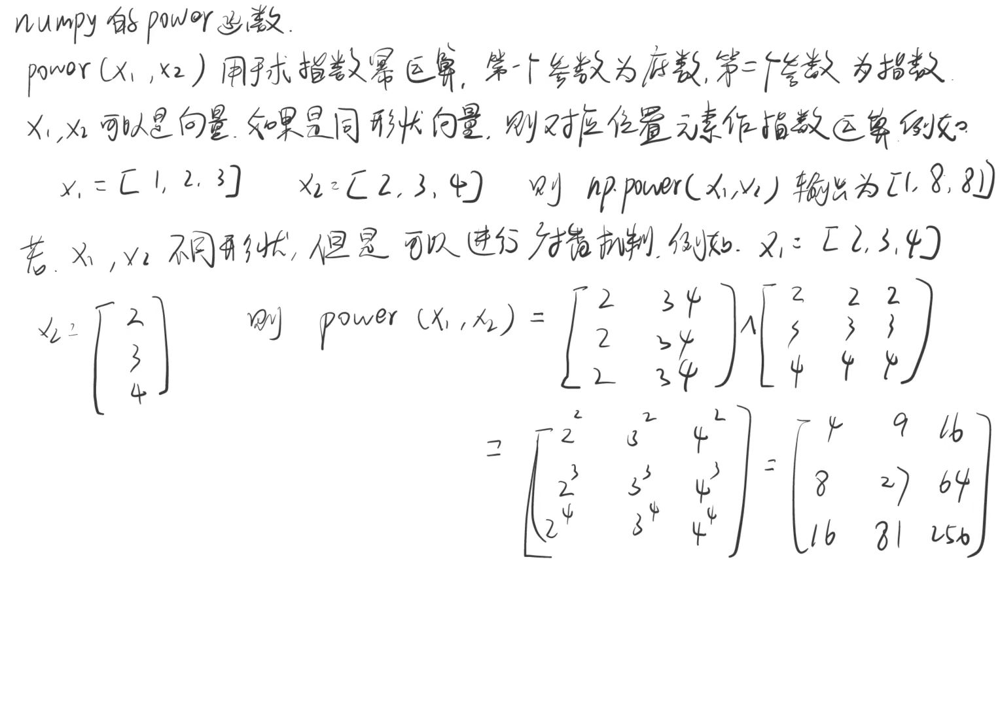

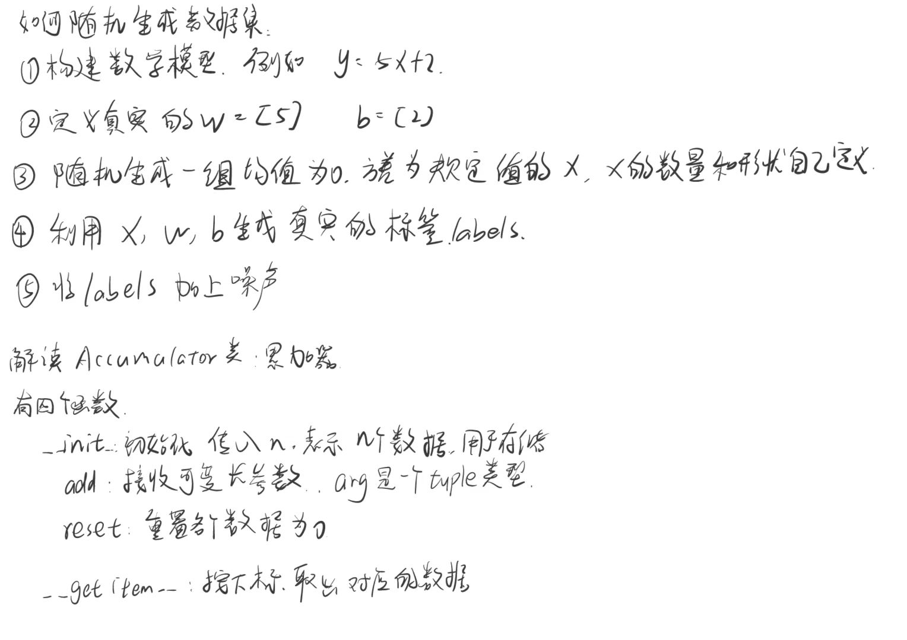

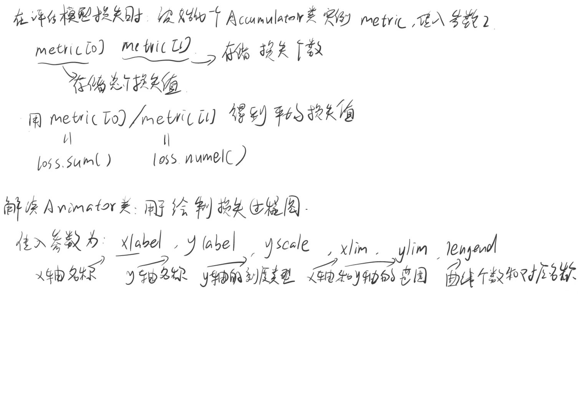