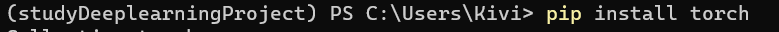

## 2023年6月14日记

1.pycharm配置github，参照csdn中的教程，如果push时出现报错信息如下

则使用csdn教程修改git端口号

2.在该工程中安装python包，打开conda的命令行

激活该项目 `conda activate studyDeeplearningProject`

在该项目下使用`pip install +包名`安装相应的包

## 2023年6月15日记

1.可以不需要单独启动conda的命令行去启动jupyter，可以直接在pycharm中使用jupyter

## 2023年6月16日记

1.分子布局和分母布局，回看不懂的话可看B站收藏的分子布局和分母布局的视频

## 2023年6月17日记

1.[08 线性回归 + 基础优化算法](https://www.bilibili.com/video/BV1PX4y1g7KC?spm_id_from=333.1245.0.0)手写笔记

2.项目中无法安装d2l

参考csdn教程：[解决无法安装d2l](https://blog.csdn.net/sriting/article/details/129600084?ops_request_misc=%257B%2522request%255Fid%2522%253A%2522168697137016800226566225%2522%252C%2522scm%2522%253A%252220140713.130102334.pc%255Fall.%2522%257D&request_id=168697137016800226566225&biz_id=0&utm_medium=distribute.pc_search_result.none-task-blog-2~all~first_rank_ecpm_v1~rank_v31_ecpm-4-129600084-null-null.142^v88^koosearch_v1,239^v2^insert_chatgpt&utm_term=ERROR%3A%20Failed%20building%20wheel%20for%20pandas%20Failed%20to%20build%20pandas%20ERROR%3A%20Could%20not%20build%20wheels%20for%20pandas%2C%20which%20is%20required%20to%20install%20pyproject.toml-based%20projects&spm=1018.2226.3001.4187)

3.报错`ModuleNotFoundError: No module named 'torchvision'`，表示没有安装这个包，在命令行中安装即可

4.yield函数：指一个有yield语法的函数。

yield与return的不同：执行完一句yield语句后，会跳出函数，并返回yield生的值，并在此处设置一个断点。函数会在下次再调用该涵数时直接从上次断点处接下去执行。可以使用for语法接收yield函数生成的数据。

[yield语法详解]([(76条消息) python中yield的用法详解——最简单，最清晰的解释_python yield_冯爽朗的博客-CSDN博客](https://blog.csdn.net/mieleizhi0522/article/details/82142856?ops_request_misc=%7B%22request%5Fid%22%3A%22168699956216800211544533%22%2C%22scm%22%3A%2220140713.130102334.pc%5Fall.%22%7D&request_id=168699956216800211544533&biz_id=0&utm_medium=distribute.pc_search_result.none-task-blog-2~all~first_rank_ecpm_v1~rank_v31_ecpm-2-82142856-null-null.142^v88^koosearch_v1,239^v2^insert_chatgpt&utm_term=python中的yield和for&spm=1018.2226.3001.4187))

2023年6月18日记

1.《softmax回归》笔记

